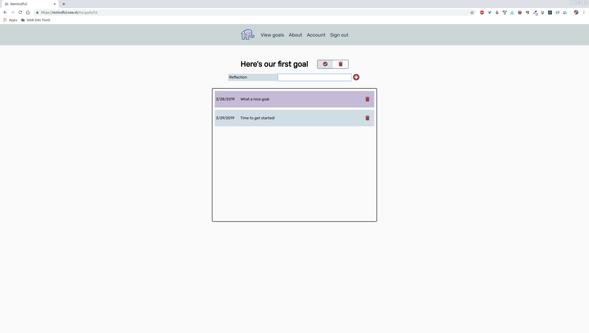

Remindful
=========

[remindful.now.sh](http://remindful.now.sh)
-------------------------------------------

App summary: 

Remindful allows users to record and write about their personal goals. On the first of every month, users receive an email encouraging them to check on their goals and write about their progress. It gives users a dedicated space to track what's important to them and provides a little nudge to check in once a month without the stress and annoyance of constant notifications that many goal tracking applications have. 

Users can add and delete goals. They can also mark goals as completed without deleting them from their list. Users can also add and delete reflections for each goal in their list. Emails are automatically sent out on the first of every month to users using Heroku Scheduler and Nodemailer. Users can easily delete their accounts if they want to stop receiving emails. Finally, there is a demo account that can be accessed from the About page. This account is protected from deletion on both the front and back end. 

About page

Sign up page

Log in page

Goals page

Goal details page

Account page

Protected account page

Email sample
  

API: 

Sign Up(POST)
The sign up page sends a POST request to /api/users containing the values the user enter for their first name, last name, email address, and password. 

Log in(POST)
The log in page sends a POST request to /api/auth/login containing the values users enter for their email address and password. The API will respond with an auth token on a valid request. 

About(POST)
If users click the button to try Remindful without signing up, a POST request is sent to /api/auth/login containing the correct credentials for the test account. The API will respond with an auth token. 

View Goals(GET)
A GET request is sent from App.js to request the goals list. The request must contain a header that contains the user's auth token. On a valid request, the API will respond with an array containing the user's goals. The goals are passed via context to give components access to them. 

Add Goal(POST)
A POST request is sent to /api/add-goal containing the name the user entered for the goal. The request must contain a header that contains the user's auth token. The API will respond with the goal object, which is then added to context. 

Goal Detail(GET)
A Get request is sent to /api/add-goal/:goalId. Note that the goal ID is sent in as a parameter in this case. The request must contain a header that contains the user's auth token. On a valid request, the API responds with an array containing the reflections for that goal. 

Goal Detail(POST)
A POST request is sent to /api/reflections. The request must contain a header that contains the user's auth token. The body of the request must contain the goal ID the reflection corresponds with and the content for the reflection. On a valid request, the API responds with a 201 created and an object containing the refleciton itself on a successful post. 

GoalDetail(DELETE) - Reflection
A DELETE request is sent to /api/reflections. The request must contain a header that contains the user's auth token. The body of the request must contain the ID of the goal to be deleted. On a valid request, the API responds with a 200 status. 

GoalDetail(DELETE) - Goal
A DELETE request is sent to /api/my-goals. The request must contain a header that contains the user's auth token. The body of the request must contain the ID of the goal to be deleted. On a valid request, the API responds with a 200 status. 

GoalDetail(PATCH) - Goal
A PATCH request is sent to /api/my-goals. The request must contain a header that contains the user's auth token. The body of the request must contain the name of the goal, the reflections corresponding with that goal, the complete status of the goal (boolean: true or false), and the ID of the goal. On a valid request, the API responds with a 200 status and the updated goal object. 

Account(DELETE)
A DELETE request is sent to /api/users. The request must contain a header that contains the user's auth token. On a successful delete, the API responds with a 200 status. 

Technologies used: 
Client: HTML, CSS, JavaScript, React. Deployed using Zeit's Now. 

Server: Express, Bcrypt, Helmet, Knex, Morgan, Heroku Scheduler, Nodemailer, Postgrator, Chai, Mocha, Supertest. Deployed using Heroku. 